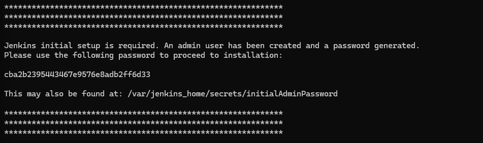
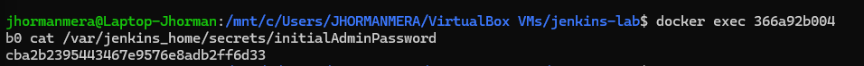
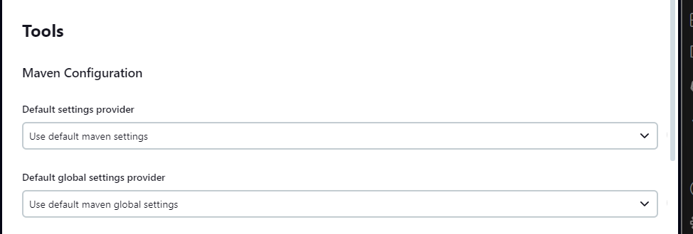

# Jenkins Lab

## Ejecutar Docker Compose

Para ejecutar Docker Compose, asegúrate de que tengas Docker Compose instalado en tu sistema. Luego, sigue estos pasos:

1. Navega a la ubicación donde se encuentra tu archivo `docker-compose.yml`.

Nota: En el archivo `docker-compose.yml` se debe agregar un volumen para asegurar la persistencia de los datos del contenedor de jenkins en caso de falla y se debe exponer el puerto `3000` en esta solución debido a que es una app web desarrollada con Node.js (Por defecto jenkins no usa por si mismo el puerto `3000`)

```
version: '3.7'

services:
  jenkins:
    image: jenkins/jenkins:lts
    ports:
      - "8080:8080"
      - "3000:3000"
    volumes:
      - jenkins_data:/var/jenkins_home

volumes:
  jenkins_data:
```

2. Ejecuta el siguiente comando en tu terminal para iniciar los contenedores definidos en el archivo `docker-compose.yml`:

```bash
docker-compose up -d
```

#### Verificamos el estado del contenedor usando el comando `docker ps`


3. Extraer passwords

```bash
docker logs id_container
```


#### Se debe buscar el siguiente apartado donde se muestra la contraseña de acceso por defecto



Otra forma de extraer la contraseña es con el comando:

```bash
docker exec id_container cat /var/jenkins_home/secrets/initialAdminPassword
```


En caso de querer correr el contenedor sin hacer uso del archivo `docker-compose.yml` se puede usar el comando:

```
docker run --name jenkins -d -p 8080:8080 -p 3000:3000 -v jenkins_data:/var/jenkins_home jenkins/jenkins:lts
```
### Ingresamos a la página de Jenkins e iniciamos su configuración
 
 La url para ingresar es `localhost:8080`

Se debe usar la contraseña extraida anteriormente para ingresar como administrador


Elegimos el tipo de instalación de jenkins a gusto


Seleccionamos Node.js en la lista de plugins a instalar (No se debe deseleccionar los que vienen seleccionados por defecto), luego se iniciará la descarga de los plugins y sus dependencias


Creamos el usuario administrador de jenkins para usarlo en futuros ingresos


En la página inicial de Jenkins, buscamos en el menu vertical la opción `administrar jenkins` o `manage jenkins`


Seleccionamos la opción `tools` y configuramos la herramienta del proyecto agregando a esta `Node.js` versión `10.15.2`





En el menu vertical seleccionamos `nueva tarea` o `new item` para crear el projecto, seguido asignamos un nombre seleccionamos el tipo `freestyle project` o `proyecto estilo libre`

Agregamos una descripción al proyecto
Cambiamos la fuente del código a `Git` y pegamos la url del repositorio de github
Nos aseguramos que la rama o ramas que se usan para construir el proyecto son las correctas, por defecto viene `master` puede ser necesario cambiarla a `main` o agregar más ramas según la implementación


Para este caso no se configuran `triggers` o `disparadores`

En `Entorno de Compilación` o `Build Environment` seleccionamos `proporcionar node & npm bin/ a la carpeta PATH` o `provide node & npm bin/ folder to PATH`


Agregamos un nuevo `Paso de Compilación` o `Build Step` y en el menu desplegable seleccionamos `Execute shell` o `Ejecutar Script de Shell` y agregamos los siguientes comandos para su ejecución:

```
npm install
npm run build
node app.js
```


Oprime `guardar` o `save`


En la página principal de Jenkins ejecutamos manualmente el proyecto que acabamos de crear


Al verificar la consola del proyecto podemos ver los posibles errores en la ejecución o los mensajes que se lanzan durante la compilación


Si todo está bien, se puede ingresar a la app usando la url `localhost:3000`


Finalmente, al ingresar a la ip del servidor podemos ver la aplicación corriendo perfectamente

